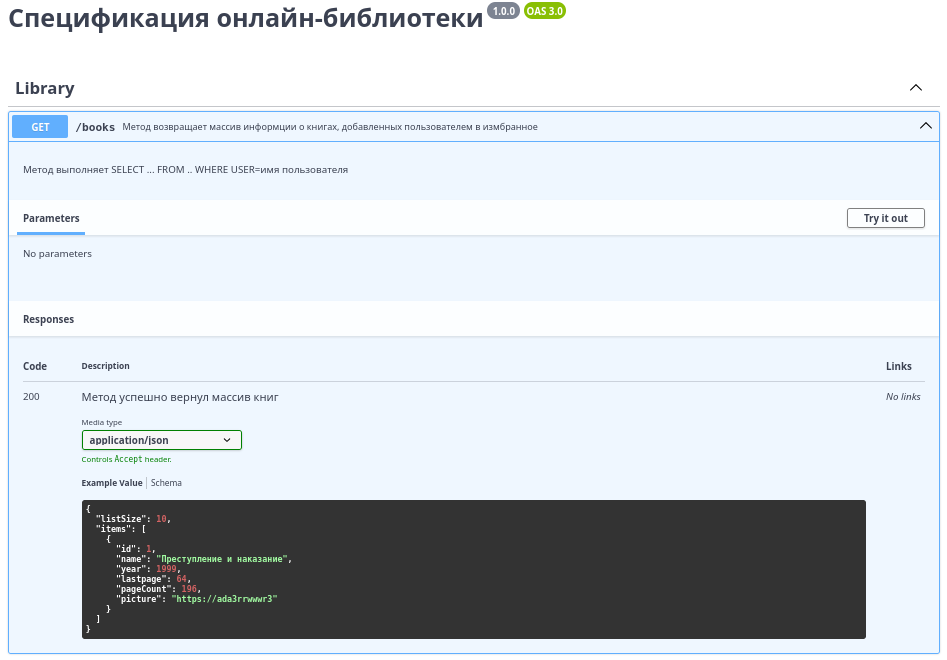
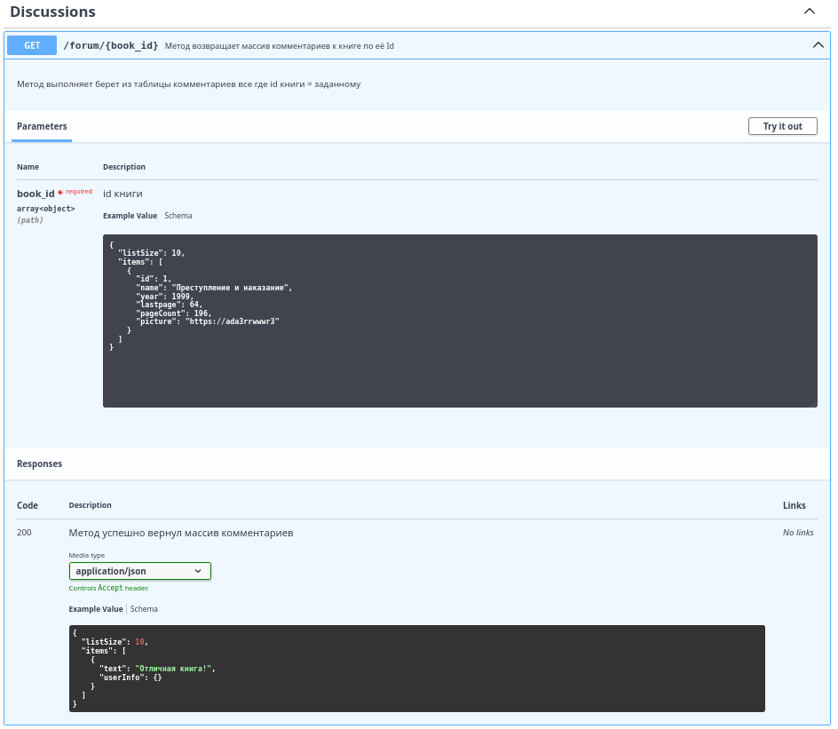
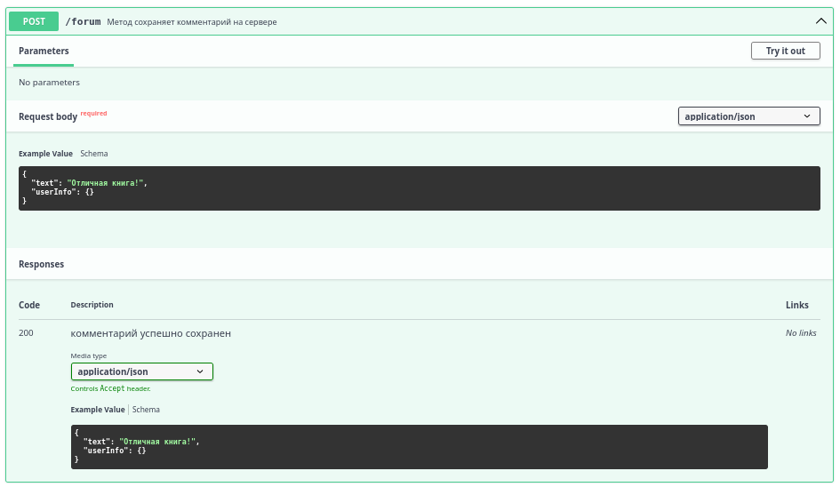
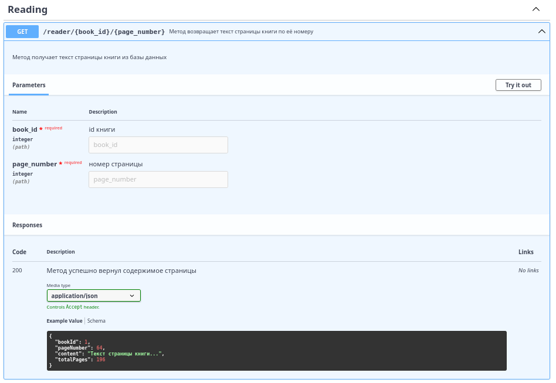
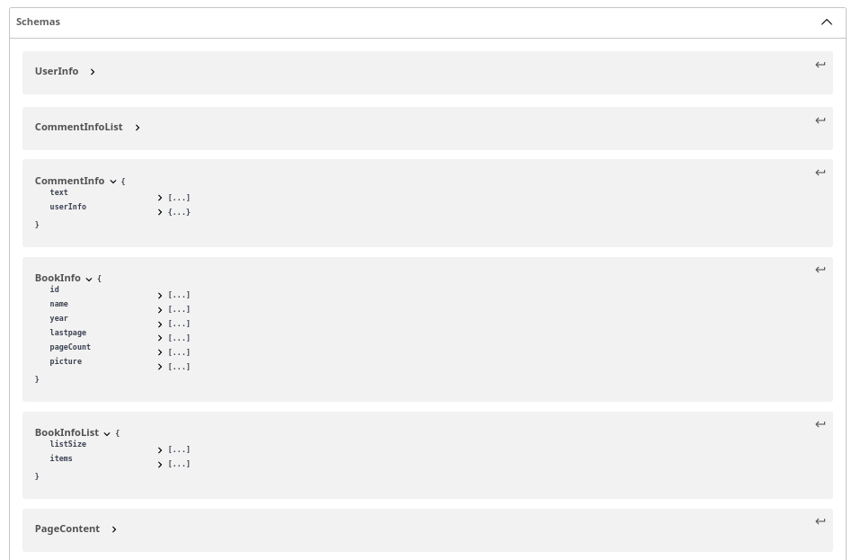

# machine
Реализовали классы Printer и StringSummer, а также ![pipeline] Все настройки сборки проекта в build.gradle.

Python скрипт находится в scripts/collaborators_info.py. ui тесты включены в этап с юнит тестированием

# ui интеграционные тесты

## 

# swagger и фронтенд

Более ранние работы- (https://github.com/Sovushkaaa/minijam)
(https://github.com/users/Sovushkaaa/projects/3)
